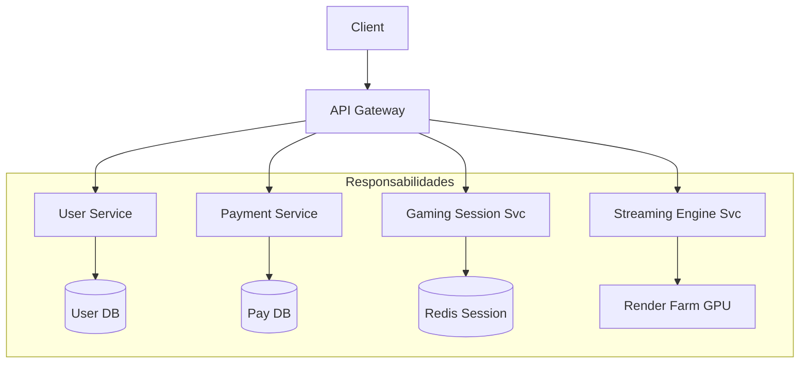
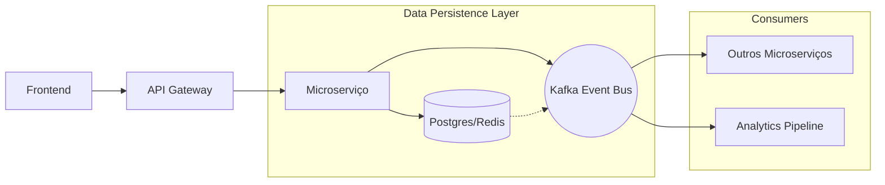
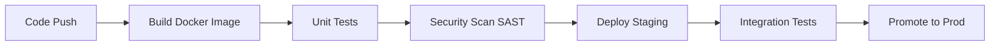

# 🏗 Documento de Arquitetura de Software

| Campo | Valor |
| :--- | :--- |
| **Projeto** | Kuma Cloud Gaming |
| **Versão** | 1.0 (Final) |
| **Data** | 08/10/2025 |
| **Status** | Aprovado |
| **Document Owner** | Lucas Landgraf |
| **Revisores Técnicos** | Allyson Kenzo, Gabriel Juliati, Matheus Leandro, Matheus Kudlake |
| **Stakeholder Approval** | Tiago Dutra Galvão |

---

## 1. Introduction

### 1.1 Purpose
Este documento detalha as decisões arquiteturais, componentes e estratégias técnicas do **Kuma Cloud Gaming**. Ele serve como guia para garantir que a equipe compreenda o alinhamento entre as escolhas de design (Microsserviços, K8s) e os requisitos de alta performance e resiliência.

### 1.2 Scope
* **Inclui:** Arquitetura de microsserviços, Game Streaming Engine, Estratégia de Latência (<20ms), Stack Tecnológica.
* **Não Inclui:** Implementação de baixo nível (código fonte detalhado), Design de UI (Pixel-perfect).

### 1.3 Definitions and Acrônimos

| Termo | Definição |
| :--- | :--- |
| **ADR** | *Architecture Decision Record*. Documento de decisão técnica. |
| **API** | *Application Programming Interface*. |
| **CI/CD** | Integração e Entrega Contínuas. |
| **Cloud Gaming** | Jogos rodando remotamente com transmissão de vídeo. |
| **Latência** | Atraso input-to-display (Meta: < 20ms). |
| **SLA** | *Service Level Agreement*. (99,9% uptime). |

### 1.4 References
* **[Project Charter](./01-Project-Charter.md)**
* **[ADR-001](./03-ADR-Microservices.md)**
* *NVIDIA vGPU Software User Guide*

---

## 2. Architectural Overview

### 2.1 System Vision
Plataforma de cloud gaming que elimina a necessidade de hardware caro, permitindo que qualquer pessoa jogue games de alta qualidade em qualquer dispositivo, com latência inferior a 20 ms e capacidade de suportar até 1 milhão de usuários.

### 2.2 High-Level Architecture (Context)

```mermaid
graph TD
    User["Jogadores (Qualquer Dispositivo)"] -->|HTTPS / WebRTC| Kuma[Kuma Cloud Gaming]
    
    subgraph "Kuma Cloud Cluster (Kubernetes)"
        Engine["Streaming Engine (C++/Rust)"]
        API[Backend API (Python/Go)]
        DB[(PostgreSQL)]
        Cache[(Redis)]
    end
    
    Kuma --> Engine
    Kuma --> API
    Engine <--> API
    API --> DB
    API --> Cache
    Engine --> Cache
```

### 2.3 Key Architectural Principles
* **Performance First:** Engine otimizada em C++/Rust para garantir baixa latência.
* **Security by Design:** Comunicação criptografada de ponta a ponta.
* **API-First:** Funcionalidades expostas via RESTful APIs.
* **Microservices:** Serviços independentes e escaláveis de forma isolada.
* **Event-Driven:** Comunicação assíncrona para operações não-críticas.
* **Cloud-Native:** Containers e auto-scaling com Kubernetes.

## 3. Stakeholders & Concerns

| Stakeholder | Preocupação Principal | Endereçamento na Arquitetura |
| :--- | :--- | :--- |
| Gamers | Qualidade (sem lag, 4K). | Otimização independente do motor de streaming. |
| Publishers | Monetização e Segurança. | Marketplace seguro e DRM. |
| Executivos | Lucro e Viabilidade. | Escalabilidade horizontal (controle de custos). |
| Dev Team | Recursos e Prazos. | Poliglotismo (C++ e Python), CI/CD e K8s. |

## 4. Architectural Decisions

### 4.1 Key ADRs

| ID | Decisão | Status | Impacto |
| :--- | :--- | :--- | :--- |
| ADR-001 | Arquitetura de Microsserviços | ✅ Accepted | Alto |
| ADR-002 | PostgreSQL como DB Principal | ✅ Accepted | Alto |
| ADR-003 | Event Bus (Kafka) | 📝 Proposed | Alto |
| ADR-004 | Redis para Cache Distribuído | ✅ Accepted | Médio |

### 4.2 Technology Stack
* **Application Layer:** Python/Go, Express.js, JWT.
* **Data Layer:** PostgreSQL (Primário), Redis (Cache), Elasticsearch (Logs).
* **Infrastructure:** Docker, Kubernetes (GKE), Prometheus + Grafana.
* **Frontend:** React.js (Web Dashboard), React Native (Mobile).

## 5. System Decomposition

### 5.1 Service Architecture



### 5.2 Service Responsibilities
* **User Service:** Autenticação, Gestão de Perfis, Controle de Permissões (RBAC).
* **Gaming Session Service:** Orquestração de sessões, Matchmaking, Monitoramento de latência em tempo real.
* **Payment Service:** Gestão de assinaturas recorrentes, Faturamento, Processamento de transações.
* **Streaming Engine Service:** Renderização remota de gráficos, Encoding de vídeo (H.264/H.265), Captura de input.

## 6. Data Architecture

### 6.1 Data Strategy
* **Padrão:** Database-per-Service (Banco de dados isolado por serviço para evitar acoplamento).
* **Audit Trail:** Pattern de Event Sourcing utilizando Kafka para rastreabilidade total.
* **Consistência:**
    * Forte (ACID): Para transações financeiras (Payment Service).
    * Eventual (BASE): Para Analytics e Dashboards.

### 6.2 Data Flow Diagram



### 6.3 Data Models (High-Level)

**User Domain (PostgreSQL)**

| Campo | Tipo | Descrição |
| :--- | :--- | :--- |
| id | UUID | Primary Key. |
| email | VARCHAR | Login único do usuário. |
| role | ENUM | PLAYER, ADMIN, DEV. |

**GameSession Domain (Redis)**

| Campo | Tipo | Descrição |
| :--- | :--- | :--- |
| session_id | UUID | Primary Key. |
| status | ENUM | ACTIVE, PAUSED, ENDED. |
| latency | FLOAT | Métrica de latência em tempo real (ms). |

## 7. Security Architecture

### 7.1 Principles
* **Zero Trust:** Nenhuma requisição é confiável por padrão, mesmo dentro do cluster.
* **Defense in Depth:** Múltiplas camadas de segurança (WAF, VPC, Security Groups).
* **Least Privilege:** Serviços operam com permissões mínimas necessárias.
* **Data Encryption:** Dados criptografados em repouso (AES-256) e trânsito (TLS 1.3).

### 7.2 Auth Flow

```sequenceDiagram
    participant Client
    participant Gateway as API Gateway
    participant Auth as Auth Service
    participant DB as Database

    Client->>Gateway: Envia Credenciais (HTTPS)
    Gateway->>Auth: Valida Request
    Auth->>DB: Verifica Hash da Senha
    DB-->>Auth: Dados Válidos
    Auth-->>Gateway: Emite JWT (Access + Refresh Token)
    Gateway-->>Client: Retorna Token JWT
    
    Note over Client, Gateway: Requests subsequentes usam o Bearer Token
```

## 8. Quality Attributes (NFRs)

**Métricas de Qualidade**

| Métrica | Target | Método de Medição |
| :--- | :--- | :--- |
| API Response | < 150ms (p95) | Application Monitoring (APM). |
| DB Queries | < 30ms (avg) | Database Profiling e Slow Query Logs. |
| Page Load | < 2s | Browser Real User Monitoring (RUM). |
| Scale | 1 Milhão Users | Load Testing distribuído (K6/JMeter). |

**Estratégias de Resiliência**
* **Disponibilidade:** Target de 99.95% atingido via deploy Multi-Region + Multi-AZ.
* **Escalabilidade:** Kubernetes HPA (Horizontal Pod Autoscaler) baseado em métricas de CPU e GPU.
* **Segurança:** Implementação de OAuth 2.0 e TLS 1.3 obrigatório.

## 9. Deployment Architecture

### 9.1 Environments
* **Development:** Cluster Kubernetes único, recursos compartilhados (Namespaces isolados).
* **Staging:** Espelho exato de produção (mesma topologia) para testes de integração.
* **Production:** Cluster Multi-AZ com alta disponibilidade e redundância.

### 9.2 Infrastructure as Code (IaC)

```YAML
# Exemplo: kubernetes/production/namespace.yaml
apiVersion: v1
kind: Namespace
metadata:
  name: kuma-cloud-gaming-prod
  labels:
    environment: production
    managed-by: terraform
```

### 9.3 CI/CD Pipeline



## 10. Operational Concerns
* **Monitoramento:** Prometheus (coleta de métricas) + Grafana (visualização dos Golden Signals).
* **Logging:** ELK Stack (Elasticsearch, Logstash, Kibana) centralizado.
* **Tracing:** Jaeger para rastreamento distribuído de transações entre microsserviços.
* **Disaster Recovery:**
    * RTO (Recovery Time Objective): 1 hora.
    * RPO (Recovery Point Objective): 15 minutos.

## 11. Evolution & Roadmap

### Technical Debt & Future Steps
* **Q1 2025:** Implementação de testes de integração abrangentes (E2E).
* **Q2 2025:** Migração de endpoints de leitura REST para GraphQL e implementação de Circuit Breakers.
* **Fase 2:** Adoção de Machine Learning para alocação preditiva de recursos de GPU.

### Scalability Roadmap

```plaintext
Current (MVP)         12 Months           24 Months
├── 10K users         ├── 500K users      ├── 1M+ users
├── 5 Services        ├── 20 Services     ├── 30+ Services
└── 1 Região          └── 6 Regiões       └── Edge Computing
```

## 12. Risks & Mitigation

| Risco | Impacto | Estratégia de Mitigação |
| :--- | :--- | :--- |
| Downtime de API Terceira | Alto | Implementação de estratégia Multi-cloud (AWS + GCP/Azure) para redundância. |
| Violação de Dados | Crítico | Criptografia de banco de dados (TDE), Pentests regulares e Auditorias de segurança. |
| Degradação de DB | Alto | Otimização contínua de queries, uso agressivo de Cache (Redis) e Database Sharding. |
| Indisponibilidade de Equipe | Médio | Documentação rigorosa (ADRs) e rotina de Cross-training para evitar silos de conhecimento. |

